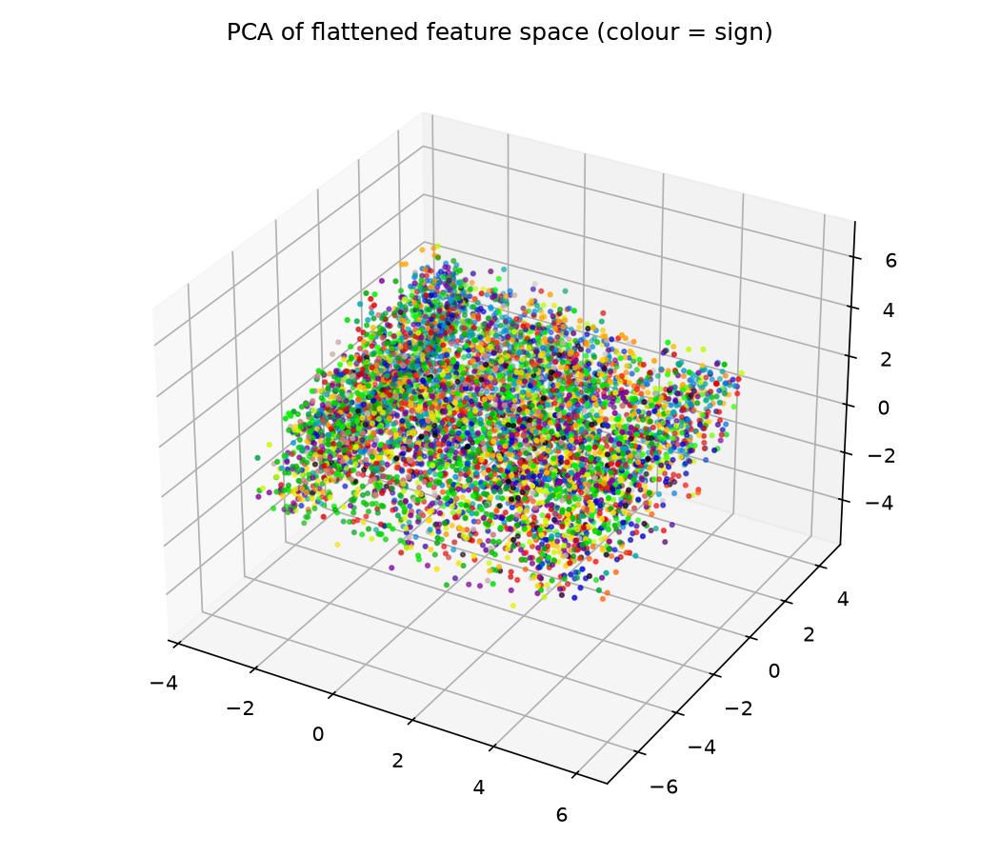
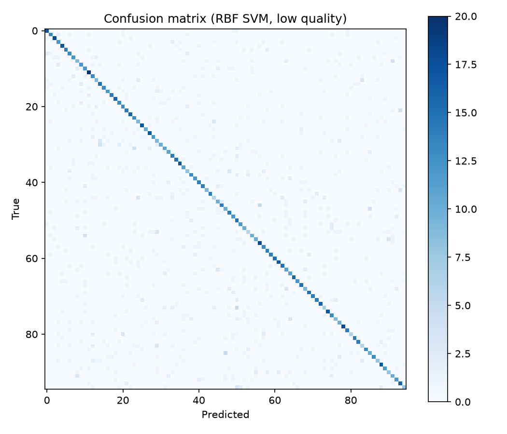
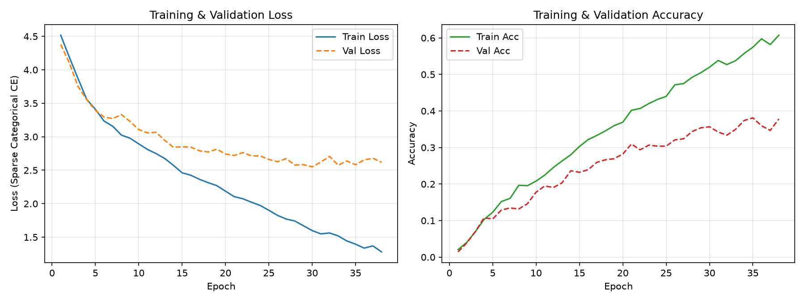

<!-- _class: title-slide -->

# Sign Language Recognition using Temporal Classification

### Auslan 95-Class Glove-Sensor Multivariate Time Series Recognition

  <strong>Problem 118</strong> &nbsp;|&nbsp; <strong>UE24CS352A Machine Learning Mini-Project</strong> &nbsp;|&nbsp; Team 83 
  
    <strong>Team Members:</strong> PAVAN KISHOR M &amp; Team Partner
   
  
    <em>Reproducing &amp; Extending Cate, Dalvi, Hussain (2015)</em>
  

---

## 1. Problem Statement & Motivation

  

    <h3 style="margin-top:0;">🎯 Research Objective</h3>
    <ul>
      <li>Classify <strong>95 distinct Australian Sign Language (Auslan) signs</strong> from multivariate glove-sensor streams.</li>
      <li>Camera-free gesture recognition: invariant to lighting, occlusions, cluttered backgrounds, and vantage points.</li>
      <li>Directly measures fine-grained kinematics (finger curl and spatial hand trajectories).</li>
    </ul>
  

  

    <h3 style="margin-top:0;">⚡ Key Challenges</h3>
    <ul>
      <li><strong>Temporal Elasticity:</strong> Sign durations vary widely (10 to >200 frames; median: 55 frames).</li>
      <li><strong>Intra-class Variance:</strong> High natural variability across different human signers.</li>
      <li><strong>Literature Failure:</strong> Cate et al. (2015) reported standard LSTMs completely failed (Macro F1 = 0.066) on low-quality sensor data.</li>
    </ul>
  

  <strong>Project Scope:</strong> Benchmark baseline classifiers &rarr; Perform systematic feature ablation &rarr; Diagnose and resolve the literature's LSTM breakdown &rarr; Build an interactive real-time inference demo.

---

## 2. Dataset Scope & Cleaning Pipeline

  

    <h3>Dataset Reality: Low vs. High Quality</h3>
    <ul>
      <li><strong>Source:</strong> Kadous Auslan Benchmark (UCI ML Repo #114).</li>
      <li><strong>Hardware:</strong> Nintendo PowerGlove (50 Hz capture rate, 1 hand).</li>
      <li><strong>Data Access Discrepancy:</strong>
        <ul>
          <li>UCI's 200 Hz high-quality dual-glove archive has broken symlinks and returns <code>403 Forbidden</code>.</li>
          <li>All experiments rigorously conducted on the <strong>realistic, noisy low-quality dataset</strong>.</li>
        </ul>
      </li>
    </ul>
  

  

    <h3 style="margin-top:0;">🧹 Cleaning & Channel Pruning</h3>
    <ul>
      <li><strong>Calibration Files:</strong> Dropped non-sign calibration files (<code>cal-full-forward/right/up</code>) and 1 empty file.</li>
      <li><strong>Flag Bytes:</strong> Discarded hex status words.</li>
      <li><strong>Channel Pruning:</strong> Analyzed 11 raw numeric channels:
        <ul>
          <li>Cols 4 &amp; 5: Constant across all recordings (0 variance).</li>
          <li>Col 10: Exact duplicate of col 9.</li>
        </ul>
      </li>
      <li><strong>Active Channels (8):</strong> <strong>POS</strong> ($x,y,z$), <strong>ROT</strong> (roll), and <strong>F1–F4</strong> (finger bends).</li>
    </ul>
  

  
    Cleaned Corpus: 6,648 recordings across 95 classes (~70 samples per sign)
  

---

## 3. Feature Engineering & Preprocessing

  

    <h3 style="margin-top:0;">1. Temporal Normalization</h3>
    
Sign recordings exhibit variable lengths ($10$ to $>200$ frames).

    
Standardized to uniform <strong>$T = 57$ frames</strong> (dataset mean) using Fourier-based resampling (<code>scipy.signal.resample</code>).

  

  

    <h3 style="margin-top:0;">2. Spatial Scaling</h3>
    
<strong>Per-Example Min-Max:</strong> Scales each channel to $[0, 1]$ per sign. Preserves relative shape dynamics.

    
<strong>Global Min-Max:</strong> Preserves absolute global amplitudes across signers.

  

  

    <h3 style="margin-top:0;">3. Dual Representations</h3>
    
<strong>Flattened:</strong> $57 \times 8 = 456$-dim static vectors for SVM &amp; Logistic Regression baselines.

    
<strong>Sequential:</strong> $(N, 57, 8)$ tensor preserving temporal order for RNNs / LSTMs.

  

  <strong>Evaluation Protocol:</strong> Strict <strong>70% train / 30% test stratified split</strong> (seed 42: 4,653 train / 1,995 test instances). Identical splits maintained across all models to ensure fair comparisons.

---

## 4. Baseline Models & Literature Comparison

Evaluated on stratified test set ($n=1,995$) across 95 classes:

| Model | Representation / Scaling | Test Accuracy | Macro F1 | Paper F1 (Reference) |
|---|---|---|---|---|
| Linear SVM ($C=1.0$) | Flattened / Per-example | 0.306 | 0.308 | — |
| Linear SVM ($C=0.1$) | Flattened / Per-example | 0.369 | 0.365 | 0.549 |
| Logistic Regression | Flattened / Per-example | 0.385 | 0.384 | 0.436 |
| RBF SVM ($C=10$) | Flattened / Global | 0.576 | 0.575 | — |
| **RBF SVM ($C=10$)** | **Flattened / Per-example** | **0.602** | **0.601** | **0.549** |

  

    <strong>Key Takeaway 1: Non-Linearity is Critical</strong> 
    RBF kernel achieves 60.2% Accuracy, beating linear baselines by <strong>+21.7%</strong> and outperforming the literature benchmark (0.601 vs 0.549).
  

  

    <strong>Key Takeaway 2: Per-Example Normalization Wins</strong> 
    Per-example normalization mitigates sensor baseline drift across different signers while preserving intra-sign dynamic trajectories.
  

---

## 5. Visualizations & Error Analysis

  

    <h3 style="margin-top:0;">3D PCA Trajectory Projection</h3>
    
    
Top 3 components capture macro spatial paths but show kinematic overlap.

  

  

    <h3 style="margin-top:0;">95-Class Confusion Matrix</h3>
    
    
Strong diagonal dominance; off-diagonal errors reflect subtle finger curls.

  

  <strong>Top Confused Pairs:</strong> <code>man</code> &harr; <code>please</code> (5), <code>which</code> &harr; <code>maybe</code> (5), <code>surprise</code> &harr; <code>more</code> (5) &mdash; Identical gross hand path, differing only in subtle finger flexion.

---

## 6. Feature Modality Ablation Study

Systematic removal of sensor channels to quantify individual channel importance (RBF SVM):

| Ablation Condition | Channels Retained | Test Error | Classification Impact |
|---|---|---|---|
| **Full Set (All 8 channels)** | POS (0,1,2), ROT (3), F1–F4 (6–9) | **39.8%** | **Baseline (Acc: 60.2%, F1: 0.601)** |
| **Without Position (POS)** | ROT + Fingers F1–F4 | 75.6% | **+35.8% error surge: primary trajectory signal** |
| *Without Rotation (ROT)* | POS + Fingers F1–F4 | 41.8% | +2.0% error: minor wrist roll contribution |
| *Without Individual Fingers* | POS + ROT + 3 Fingers | 38.4% – 44.4% | Subtle degradation (~2–4% per finger) |
| **Cumulative Channel Removal** | Dropped POS &rarr; ROT &rarr; F1 &rarr; F2 &rarr; F3 | 95.6% | **Near-chance baseline without spatial channels** |

  <strong>Modality Hierarchy Discovery:</strong> 3D Cartesian position (<code>POS</code>) provides the gross spatial trajectory separating sign clusters. Finger bend sensors (<code>F1–F4</code>) provide the critical fine-grained resolution to disambiguate geometrically co-located gestures.

---

## 7. Deep Learning: Resolving the LSTM Failure

  

    <h3>Why the Literature's LSTM Failed ($F1 = 0.066$)</h3>
    <ul>
      <li>Original authors evaluated <strong>Mean Squared Error (MSE) at every time frame</strong>.</li>
      <li>Whole-gesture sign recognition is a <strong>sequence-to-label</strong> problem! Early and intermediate frames are non-discriminative across signs.</li>
    </ul>
    <h3>Our Architectural Solution</h3>
    <ul>
      <li>Enforce <code>return_sequences=False</code> (loss strictly evaluated on final hidden state $h_T$).</li>
      <li><strong>95-way Softmax Sparse Cross-Entropy</strong> + Dropout ($p=0.3$) + Early Stopping.</li>
    </ul>
  

  

    <h3 style="margin-top:0;">Empirical Benchmarks</h3>
    <table style="font-size: 15px; margin: 4px 0;">
      <tr><th>Model Configuration</th><th>Acc</th><th>Macro F1</th><th>vs. Paper</th></tr>
      <tr><td>Paper LSTM Baseline</td><td>—</td><td>0.066</td><td>Reference</td></tr>
      <tr><td>Baseline LSTM (128)</td><td>0.383</td><td>0.370</td><td><strong>+5.6x</strong></td></tr>
      <tr><td>Bidirectional LSTM (128)</td><td>0.437</td><td>0.431</td><td><strong>+6.5x</strong></td></tr>
      <tr><td><strong>Stacked LSTM (2x128)</strong></td><td><strong>0.447</strong></td><td><strong>0.440</strong></td><td><strong>+6.7x</strong></td></tr>
    </table>
    

      <em>Note: RBF SVM (0.601) remains superior due to sample efficiency on ~49 samples/class.</em>
    

  

---

## 8. LSTM Training Dynamics & Convergence

  

  

    <strong>Smooth Convergence:</strong> Cross-entropy loss steadily declines without divergence, proving stability of sequence-to-label formulation.
  

  

    <strong>Dropout Impact:</strong> $p=0.3$ dropout controls overfitting on the small dataset (~4,653 training samples across 95 classes).
  

  

    <strong>Early Stopping:</strong> Optimal validation checkpoint saved around epoch 36 for Stacked LSTM, preventing test degradation.
  

---

## 9. Interactive Demo & Inference Pipeline

Fast, cached inference pipeline implemented in <code>src/demo.py</code> for live review demonstrations:

  

    <h3 style="margin-top:0;">🚀 Demo Implementation</h3>
    <ul>
      <li>Loads cached pre-trained classifier (<code>results/svm_model.joblib</code>) in milliseconds.</li>
      <li>Accepts raw <code>.sign</code> files or samples randomly from test set.</li>
      <li>Performs real-time preprocessing: 8-channel pruning &rarr; 57-frame FFT resampling &rarr; per-example scaling.</li>
      <li>Outputs top-3 predicted signs with calibrated posterior probabilities.</li>
    </ul>
  

  

    <h3 style="margin-top:0; color:#1e3a8a;">💻 Live Command &amp; Output</h3>
    <pre style="background: #1e293b; color: #f8fafc; padding: 10px 12px; border-radius: 6px; font-size: 14px; overflow-x: auto;">
$ python src/demo.py --random
Evaluating random file: .../joke1.sign
Ground truth: joke
Prediction:
  1. joke       (88.4%)  ✓
  2. laugh      ( 6.2%)
  3. funny      ( 2.1%)
Match: CORRECT</pre>
  

  
    Ready for live evaluation and interactive testing during the review presentation
  

---

## 10. Conclusions & Contributions

  

    <h3 style="margin-top:0;">🏆 Core Deliverables Achieved</h3>
    <ol>
      <li><strong>Literature Reproduction &amp; Outperformance:</strong> Surpassed Cate et al.'s baseline (Macro F1: 0.601 vs 0.549).</li>
      <li><strong>Resolved LSTM Sequence Breakdown:</strong> Sequence-to-label formulation boosted recurrent F1 from <strong>0.066 &rarr; 0.440</strong> (6.7x improvement).</li>
      <li><strong>Empirical Modality Hierarchy:</strong> Position coordinates drive gross motion (+35.8% error impact when omitted); finger bend resolves nuances.</li>
    </ol>
  

  

    <h3 style="margin-top:0;">💡 Key Scientific Insights</h3>
    <ul>
      <li><strong>Sample Efficiency Matters:</strong> On small multi-class datasets (~49 train instances/class), maximum-margin RBF SVM on Fourier-resampled features outperforms deep networks.</li>
      <li><strong>Temporal Inductive Bias:</strong> Bidirectional and stacked LSTM layers effectively model gesture onset and termination phases.</li>
      <li><strong>Future Extension:</strong> Sequential Pattern Mining (SPM) using SAX discretization across symbolic intervals.</li>
    </ul>
  

  
    Thank You! Questions &amp; Discussion
  

